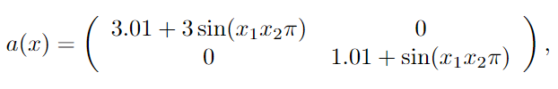
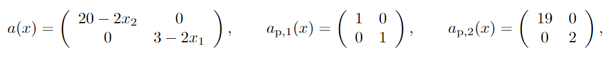

# Preconditioned discontinuous Galerkin method and convection-diffusion-reaction problems with guaranteed bounds to resulting spectra, 2023
Authors: Liya Gaynutdinova1, Martin Ladecky2, Ivana Pultarová1, Miloslav Vlasák1, and
Jan Zeman1

1 Faculty of Civil Engineering, Czech Technical University in Prague

2 Department of Microsystems Engineering, University of Freiburg

## Example 3.1 
In the example ... we show preconditioning of the diffusion-reaction problem where $\Omega=(0,1)\times (0,1)$,

$c=1$, $c_{\rm p}=1$, $f=10$.

## Example 4.1 
In the example ... we consider equation 

$-\nabla\cdot\left(a(x)\nabla u(x)\right)+b(x)\cdot \nabla u(x)+c(x)u(x)=f(x),\;\; x\in \Omega$

and and its preconditioning problem with $\Omega=(0,1)\times (0,1)$,

$c=10$, $c_{\rm p}=10$, $b=10\, (-x_2,x_1)^T$, $b_{\rm p}=(0,0)^T$, $f=10$.